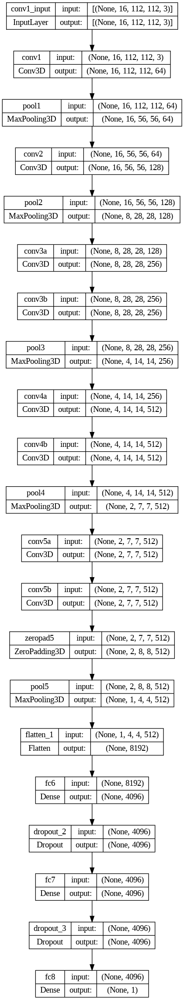

# Vision-based Vehicle Speed Estimation

CIVIL-459 Final Project: Vision-based Vehicle Speed Estimation

This work is a part of ”Building AV Autopilot” Project of CIVIL-459 course at EPFL.

This work is aim to solve this problem by estimating the ego vehicle speed using only frames from a single front-facing monocular camera with a mask of the lane to preserve spatiotemporal features as input and receive high performance of vehicle speed estimation as output.

## Files Structure:

    ego-vehicle-speed-estimation
    |
    |____data
    |      |
    |      |____c3d-sports1M_weights.h5 (unable to be upload due to no more storage usage)
    |      |
    |      |____test.mp4 (unable to be upload due to no more storage usage)
    |      |
    |      |____train.mp4 (unable to be upload due to no more storage usage)
    |      |
    |      |____test_pred.txt
    |
    |____Speed_Estimation.ipynb
    |
    |____labels.txt
    |
    |____3D_CNN_model.png
    |
    |____requirements.txt
    |
    |____val_loss.png

## Function of files

1. Speed_Estimation.ipynb - 3DCNN model with preprocessing pipeline
2. labels.txt - ground truth of train data (train.mp4). Each frame of train.mp4 has a label equal to the ego speed.
3. 3D_CNN_model.png - architecture of 3DCNN model
4. requirements.txt - required libraries
5. val_loss.png - graphic of validation loss on test data

data:

1. c3d-sports1M_weights.h5 - wights of the pre-trained model
2. test.mp4 - test video
3. train.mp4 - train video
4. test_pred.txt - model prediction of test data

## 3D CNN Architecture

